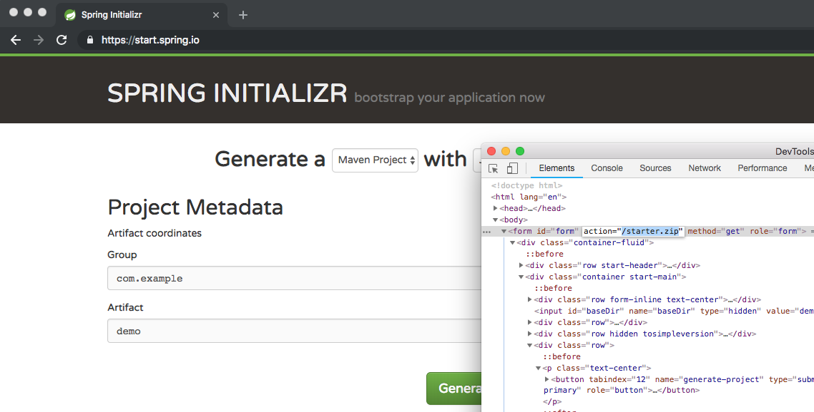
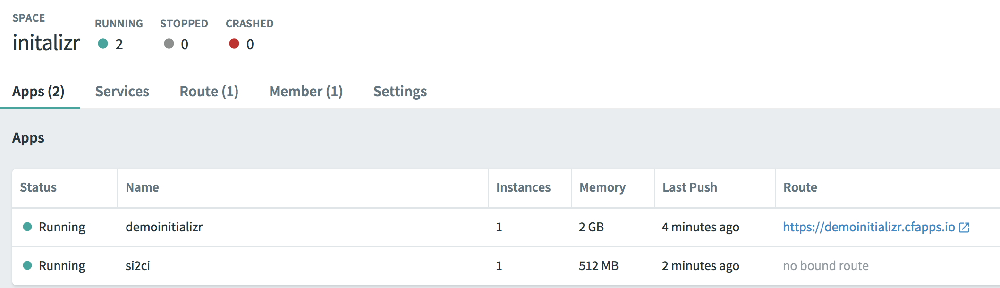

# SI2CI

SI2CI stands for Spring Initializr to Concourse CI.

This repo is home to Demo grade code that glues Spring Initializr with Concourse. The idea was to showcase a complete onboarding experience for an Enterprise Developer by bridging Spring Initializr portal with workflow that still needs to happen. This workflow is driven by Concourse to take actions such as; Create a new git Repostiory, Check in Mock code and Enterprise templates, Build a CI/CD Delivery pipeline ...

## Repo Contents

Below is the folder structure of the Repository and its contents

- ***infra*** : Terraform specs to setup concourse on GCP. *Currently only setups a cloud machine on GCP*
- ***pipeline*** : Sample Concourse pipeline that can get executed via Spring Initialzr
- ***templates*** : Template folder gets coppied into GitHub Repo that's created
- ***pkg/concourse*** : Concourse wrapper in use by the project
- ***vendor*** : Go dependencies

## Implementation

Spring Initialzr screen has a form that will perform a GET action against its `/starter.zip` endpoint based on the user input.



Since Pivotal Cloud Foundry user owns the control over the routing stack a second application can "hijack" the `./starter.zip` endpoint to execute a custom workflow. SI2CI is intended to sit behind this endpoint and capture the parameteres that would have otherwise generate a zip file.

SI2CI is developed to catch Spring Initializr form passed parameters:

- SI2CI_NAME
- SI2CI_LANGUAGE
- SI2CI_BOOTVERSION
- SI2CI_BASEDIR
- SI2CI_GROUPID
- SI2CI_ARTIFACTID
- SI2CI_DESCRIPTION
- SI2CI_PACKAGENAME
- SI2CI_PACKAGING
- SI2CI_JAVAVERSION

and append them to Concourse Pipeline variables/credentials file, so that user input from Spring Initialzr can be utilized during the pipeline execution. In sample workflow provided in the repo `SI2CI_NAME` field which is generated from Spring Project name is utilized as; Appname in Pivotal Application Services, Repo name on Github etc.

## Getting Started

At a high level there are few steps involved to get the environment up:

1. Bring up Spring Initializr
1. Create a github account for provisioning
1. Deploy SI2CI
1. Modify Pipeline and Credentials
1. Provide SI2CI runtime parameters

### Bring up Spring Initializr

The official Spring Initializr source code is location in; [https://github.com/spring-io/initializr](https://github.com/spring-io/initializr) . README documentation in the repository provides details for deploying Spring Initializr in your own infrastructure. At a high level;

Clone the repository and navigate into the folder

```sh
git clone https://github.com/spring-io/initializr.git
cd initializr
```

Build the Spring Initialzr project

```sh
./mvnw clean install
```

Create a new manifest.yml file to push Spring Initialzr to Pivotal Cloud Foundry

```yaml
---
applications:
- name: initializr
  memory: 2048M
  instances: 1
  path: initializr-service/target/initializr-service.jar
```

Push the application to Pivotal Cloud Foundry

```sh
cf push
```

Validate the Spring Initialzr is working as expected.

### Create a github account for provisioning

While this step is not strictly required for SI2CI to function, the default Pipeline located in `./pipeline` folder of this repository assumes the first step of the pipeline is to create a GitHub Repository. In order to achive this goal, [a small utility](https://github.com/alekssaul/github-create-repository) is used to programatically create a github.com repo given that a `GITHUB_TOKEN` environmental variable is provided.

Recommendation is to create a new github user such as "BotOfAleks" and [follow the instructions](https://help.github.com/articles/creating-a-personal-access-token-for-the-command-line/) to generate a token for GitHub API access. Make sure that the token has access to `repo` scope.

### Deploy SI2CI

SI2CI is a golang application with a sample `manifest.yml` located at the root of this repository. Target the same Org and Space utilized by Initialzr, then `cf push` the application. Pivotal Cloud Foundry will build the application.

**NOTE THAT** application `manifest.yml` has the `no-route` parameter set to `true`. As a result no route is assigned to the application.

You should end up with a similar setup to screenshot below



Map the `spring.zip` endpoint of the Spring Initialzr app onto si2ci app

```sh
cf map-route si2ci cfapps.io --hostname demoinitializr --path spring.zip
```

Validate the setup
```sh
cf apps
Getting apps in org fakeOrg / space initalizr as fakeUser@pivotal.io...
OK

name             requested state   instances   memory   disk   urls
demoinitializr   started           1/1         2G       1G     demoinitializr.cfapps.io
si2ci            started           1/1         512M     1G     demoinitializr.cfapps.io/spring.zip
```

### Modify Pipeline and Credentials

Create a credentials file out of sample file.

```sh
mv ./pipeline/credentials.yml.sample ./pipeline/credentials.yml
```

*Note that credentials.yml is already part of gitignore file.*

Modify the `./pipeline/pipeline.yml` and `./pipeline/credentials.yml` as you see fit. These files will be used by SI2CI to create the initial pipeline

### Provide SI2CI runtime parameters

Runtime Environmental Variables:

- `CONCOURSE_USERNAME`: Concourse Username of the user that pushes the pipelines via this code
- `CONCOURSE_PASSWORD`: Password for the Concourse User
- `CONCOURSE_TARGET`: Target conconcourse environment URL, ie: `https://concourse.company.com`
- `PIPELINE_YML`: Contents of pipeline.yml . This can as an be generated by; `export PIPELINE_YML=$(cat ./pipeline/pipeline.yml)`
- `CREDENTIALS_YML`: Contents of pipeline.yml . This can as an be generated by; `export CREDENTIALS_YML=$(cat ./pipeline/creds.yml)`

Modify the application runtime environmental variables

```sh
export APPNAME=si2ci
export CONCOURSE_USERNAME="concourseadmin"
export CONCOURSE_PASSWORD="Password1!"
export CONCOURSE_TARGET="https://concourse.company.com"
export PIPELINE_YML=$(cat ./pipeline/pipeline.yml)
export CREDENTIALS_YML=$(cat ./pipeline/creds.yml)
cf set-env $APPNAME CONCOURSE_USERNAME "$CONCOURSE_USERNAME"
cf set-env $APPNAME CONCOURSE_PASSWORD "$CONCOURSE_PASSWORD"
cf set-env $APPNAME CONCOURSE_TARGET "$CONCOURSE_TARGET"
cf set-env $APPNAME PIPELINE_YML "$PIPELINE_YML"
cf set-env $APPNAME CREDENTIALS_YML "$CREDENTIALS_YML"
```

Restage the application

```sh
cf restage $APPNAME
```
